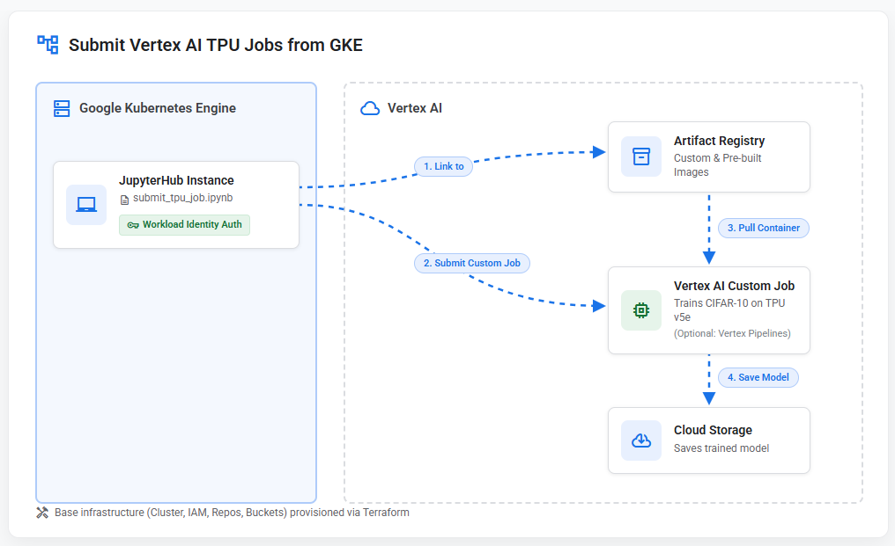

# Submit Vertex AI TPU Jobs from GKE

Run Vertex AI Custom Jobs with TPU accelerators from a JupyterHub instance on GKE, authenticated via Workload Identity (no service account keys).

## Architecture



Authentication flows through GKE Workload Identity: the JupyterHub pod's Kubernetes Service Account is bound to a Google Service Account with Vertex AI, Artifact Registry, Cloud Build, and GCS permissions.

## Repository Structure

```
├── infra/
│   ├── main.tf                  # GKE cluster, IAM, Workload Identity, JupyterHub Helm install
│   ├── variables.tf             # project_id, region, zone, cluster_name, network, repo_name
│   ├── terraform.tfvars         # Your project-specific values (edit this)
│   ├── outputs.tf               # JupyterHub URL, cluster connection command
│   └── jupyterhub-values.yaml   # Helm values for JupyterHub (image, auth, service account)
├── notebooks/
│   └── submit_tpu_job.ipynb     # Self-contained: writes Dockerfile + train.py, builds image, submits job
└── README.md
```

## Prerequisites

- [Terraform](https://developer.hashicorp.com/terraform/install) >= 1.0
- [gcloud CLI](https://cloud.google.com/sdk/docs/install) authenticated with a project that has billing enabled
- Sufficient quota for TPU v5e in the target region

## Get Started

**1. Create your tfvars file and set your project ID:**

```bash
cd infra
cp terraform.tfvars.example terraform.tfvars
# Edit terraform.tfvars — at minimum, set project_id
```

**2. Deploy everything:**

```bash
cd infra
terraform init
terraform apply
```

This creates: GKE cluster, Workload Identity bindings, Artifact Registry repo, GCS bucket, and JupyterHub.

**3. Open JupyterHub:**

Terraform outputs the JupyterHub URL. Log in with:
- **Username:** `admin`
- **Password:** `vertex`

**4. Run the notebook:**

Upload `notebooks/submit_tpu_job.ipynb` from this repo to JupyterHub and run all cells. The notebook:
1. Verifies Workload Identity is working
2. Writes a Dockerfile and CIFAR-10 training script
3. Builds and pushes the container via Cloud Build
4. Submits a Vertex AI Custom Job on TPU v5e
5. (Optional) Runs the job as a Vertex Pipeline

## Verify

After the job completes, confirm the model was saved:

```bash
gsutil ls gs://<PROJECT_ID>-tpu-pipeline-root/model/
gcloud ai custom-jobs list --region=us-central1 --filter="displayName=gke-submitted-tpu-training-job"
```

## Cleanup

```bash
cd infra
terraform destroy
```

## Non-GKE System

Pattern also extends to hybrid/on-prem Kubernetes clusters:                                                                                                                          
  - Replace GKE with any Kubernetes cluster (on-prem, other cloud provider)                                                                                                     
  - Use [Workload Identity Federation](https://cloud.google.com/iam/docs/workload-identity-federation) for keyless auth from external clusters
  - The notebook and Vertex AI job submission code remain identical

## References

- [Training with TPU accelerators](https://cloud.google.com/vertex-ai/docs/training/training-with-tpu-vm)
- [Custom container training with TPU](https://cloud.google.com/vertex-ai/docs/training/training-with-tpu-vm#custom_container)
- [GKE Workload Identity](https://cloud.google.com/kubernetes-engine/docs/how-to/workload-identity)
- [Vertex AI Pipelines](https://cloud.google.com/vertex-ai/docs/pipelines)

## TODO

- Prebuilt container example
- Add cells that showcase MLOps post training value
